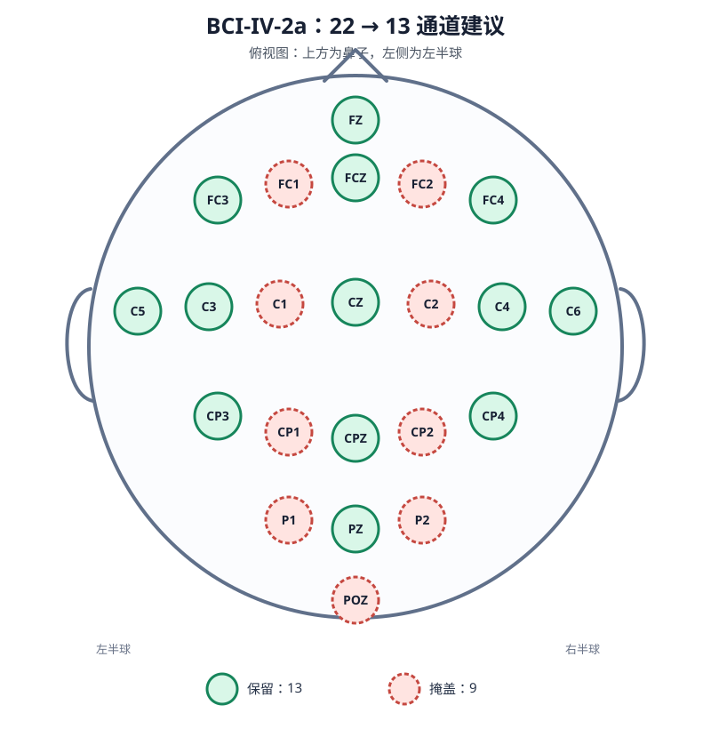

# 33N：BCI-IV-2a 从 22 通道降到 13 通道

## 结论

建议 33N 使用一个固定、左右对称、覆盖前—中—后区域的 13 通道子集。

保留 13 个通道，按原始数据顺序排列：

```python
BCIIV2A_13_CHANNELS = [
    "FZ", "FC3", "FCZ", "FC4", "C5", "C3", "CZ",
    "C4", "C6", "CP3", "CPZ", "CP4", "PZ",
]
```

掩盖 9 个通道，按原始数据顺序排列：

```python
BCIIV2A_MASKED_9_CHANNELS = [
    "FC1", "FC2", "C1", "C2", "CP1", "CP2", "P1", "P2", "POZ",
]
```



图中绿色实线电极为 33N 建议保留的通道，红色虚线电极为建议掩盖的通道。
这是电极相对关系示意图，不是按头围毫米坐标绘制的精密测量图。

## 当前 22 通道布局

当前仓库 `Channels_definition.py` 中的顺序为：

```text
FZ
FC3 FC1 FCZ FC2 FC4
C5  C3  C1  CZ  C2  C4  C6
CP3 CP1 CPZ CP2 CP4
P1  PZ  P2
POZ
```

它不是覆盖全头的常规 22 通道，而是明显集中在中央沟附近的运动相关区域。
BCI-IV-2a 的四类任务是左手、右手、双脚和舌头运动想象；数据集官方说明中
记录了 22 个 EEG 通道，原采样率为 250 Hz。

## 为什么推荐这 13 个

### 1. 保留运动想象的核心位置

`C3`、`CZ`、`C4` 是必须保留的核心通道。推荐集合还保留 `C5/C6`，让中央行
维持从左到右的宽覆盖，而不是只留下头顶正中附近的少数电极。

### 2. 保持严格的左右对称

所有成对通道都同时保留或同时掩盖：

```text
保留：FC3/FC4、C5/C6、C3/C4、CP3/CP4
掩盖：FC1/FC2、C1/C2、CP1/CP2、P1/P2
```

这样不会人为偏向左手或右手类别，也便于解释后续类别混淆矩阵。

### 3. 不把额区或顶区整排删除

跨受试者的通道重要性并不完全一致。已有 BCI-IV-2a 通道选择实验发现，通道
通常集中在 `C3/CZ/C4` 附近，但部分受试者还偏向额区或顶区。因此固定的
multi-subject 子集保留 `FZ`、`FCZ`、`CPZ` 和 `PZ` 这条前后中线，比只截取一块
紧凑中央区域更稳妥。

### 4. 对后续 33Ah 比较更友好

被掩盖的 `FC1/FC2`、`C1/C2`、`CP1/CP2`、`P1/P2` 都是左右成对的内侧位置，
周围仍有真实观测通道。33Ah 补全这些位置时，空间关系比“整排删除所有后部
通道”更合理。`POZ` 是唯一位于后部端点的被掩盖中线通道。

## 33N 中“掩盖”的建议语义

对于当前 AdaBrain all-token head，建议 33N 真正选择 13 个通道，而不是保留
22 个输入位置后把 9 个位置直接置零：

```text
原始样本：[22, 800]
33N 输入：[13, 800]
Transformer token：13 × 4 + 1 CLS = 53
分类 head 输入：53 × 200 = 10600
```

也就是说：

- dataset 按 `BCIIV2A_13_CHANNELS` 选择并重新排列真实通道；
- 传给 LaBraM 的 `ch_names` 也必须是同一个 13 通道列表；
- `num_t` 仍然是 4，不随通道数变化；
- `completion_scope=none`，33N 不产生补全 token。

后续 33Ah 使用相同 13 个真实输入通道，但在 Transformer 前补回 9 个通道，
输出恢复到 22 通道 token 空间：

```text
33N  → 13 × 4 + 1 = 53 tokens
33Ah → 22 × 4 + 1 = 89 tokens
```

## 必须记录的实验混杂因素

采用自然的 all-token head 后，33N 与 33O/33Ah 的 head 大小不同：

```text
33O / 33Ah：17800 → 4，参数量 71204
33N：       10600 → 4，参数量 42404
```

因此 33N 和 33Ah 的差异同时包含“补回通道信息”和“分类 head 容量变化”。如果
实验目标要求只比较通道信息，就需要让 33N 也保持 22 通道 token 空间，并为缺失
通道放置固定占位 token；这属于另一套对照，不能与自然 13-token 方案混为一谈。

## 方案边界

这是一套基于运动区解剖先验、跨受试者稳定性和 33Ah 可补全性的固定方案，不应
宣称是数据驱动意义上的全局最优 13 通道。文献中的学习式通道选择显示不同受试者
的最佳子集会变化。如果以后要追求最高 33N 分数，可以只使用 train/validation
进行通道排名，再锁定一个全局子集；test 不能参与选通道。

## 参考

- [BCI Competition IV：Graz data set A 官方说明](https://www.bbci.de/competition/IV/desc_2a.pdf)
- [A learnable EEG channel selection method for MI-BCI using efficient channel attention](https://www.frontiersin.org/journals/neuroscience/articles/10.3389/fnins.2023.1276067/full)
- [Parallel Spatial–Temporal Self-Attention CNN-Based Motor Imagery Classification for BCI](https://www.frontiersin.org/journals/neuroscience/articles/10.3389/fnins.2020.587520/full)
