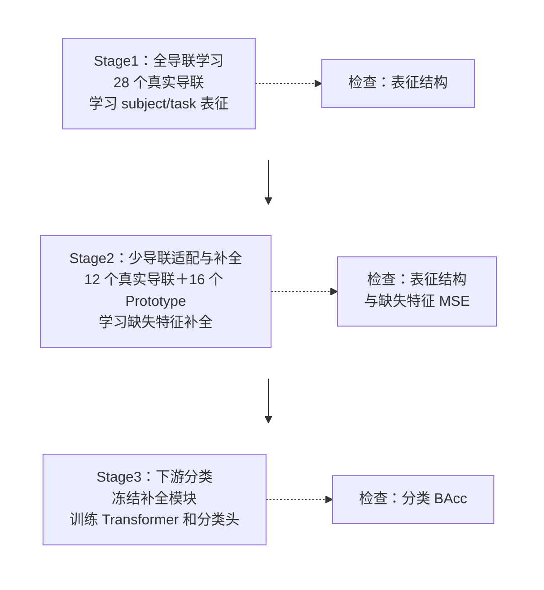
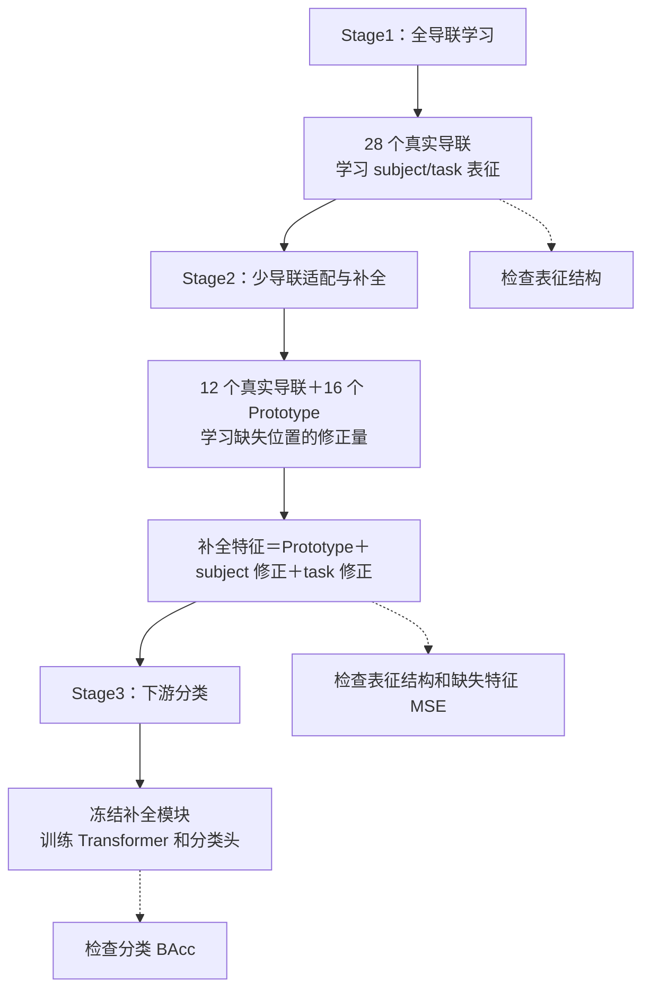

# 三阶段训练流程

```mermaid
flowchart TB
    subgraph row1[" "]
        direction LR
        S1["Stage1：全导联学习<br/>28 个真实导联<br/>学习 subject/task 表征"]
        C1["检查：表征结构"]
        S1 -.-> C1
    end

    subgraph row2[" "]
        direction LR
        S2["Stage2：少导联适配与补全<br/>12 个真实导联＋16 个 Prototype<br/>学习缺失特征补全"]
        C2["检查：表征结构<br/>与缺失特征 MSE"]
        S2 -.-> C2
    end

    subgraph row3[" "]
        direction LR
        S3["Stage3：下游分类<br/>冻结补全模块<br/>训练 Transformer 和分类头"]
        C3["检查：分类 BAcc"]
        S3 -.-> C3
    end

    row1 --> row2
    row2 --> row3

    style row1 fill:none,stroke:none
    style row2 fill:none,stroke:none
    style row3 fill:none,stroke:none
```

实线箭头表示阶段衔接，虚线箭头表示对应的检查内容。subject/task 是表征学习的设计目标，是否实现解耦需通过检查验证。

```mermaid
flowchart TB
    A["Stage1：全导联学习"] --> B["28 个真实导联<br/>学习 subject/task 表征"]
    B --> C["Stage2：少导联适配与补全"]
    C --> D["12 个真实导联＋16 个 Prototype<br/>学习缺失位置的修正量"]
    D --> E["补全特征＝Prototype＋subject 修正＋task 修正"]
    E --> F["Stage3：下游分类"]
    F --> G["冻结补全模块<br/>训练 Transformer 和分类头"]

    B -.-> H["检查表征结构"]
    E -.-> I["检查表征结构和缺失特征 MSE"]
    G -.-> J["检查分类 BAcc"]
```
