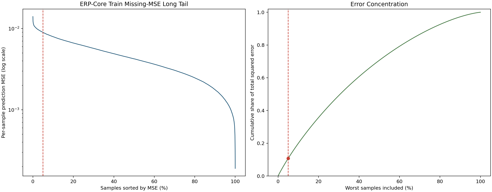
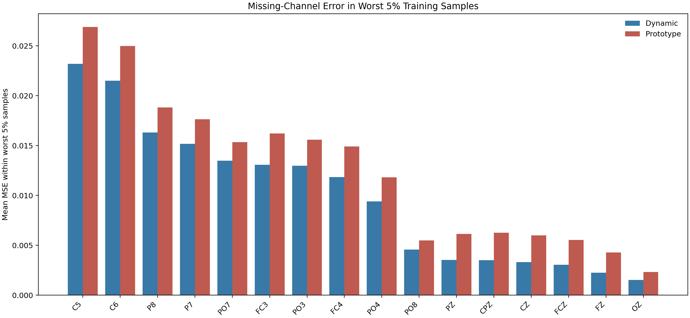

# ERP-Core：尝试从 12 导联变成 14 导联看 A/N/D 情况

## 0.动机
如果分类没有提升，问题是 missing latent 没补好，还是补出来的信息对分类没有用？


左图按每个样本的MSE(P + D_sub + D_task, h_miss_target)从大到小排序。
  - 横轴 0% 是最差样本，100% 是最好样本。
  - 纵轴是 MSE，对数坐标。
  - 红色虚线是最差 5% 的分界线，共 2,498 个样本。
  - Top 5% 阈值为 MSE >= 0.008975。
  - 最大 MSE 为 0.014051，中位数为 0.004242。
曲线没有突然断崖，说明不是极少数异常点完全控制误差，但前端仍有一段较明显的困难样本长尾。

右图把样本仍按 MSE 从高到低累加：
  - 横轴：纳入最差的多少比例样本。
  - 纵轴：这些样本贡献了全部 squared error 的多少。
  - 红点表示最差 5% 样本贡献了总误差的 10.81%。

  具体为：
   样本范围     总误差占比
  ━━━━━━━━━━━  ━━━━━━━━━━━━
   Worst 1%          2.43%
  ───────────  ────────────
   Worst 5%         10.81%
  ───────────  ────────────
   Worst 10%        19.98%
如果误差完全均匀，Worst 5% 应只贡献约 5%；现在贡献 10.81%，约为均匀情况的 2.16 倍。因此存在中等程度长尾，但不是极端长尾。再看绝对误差：
   分组          Mean MSE
  ━━━━━━━━━━━━  ━━━━━━━━━━
   全部 Train    0.004589
  ────────────  ──────────
   Worst 5%      0.009921
  ────────────  ──────────
   其余 95%      0.004309

Worst 5% 的平均 MSE 是其余样本的约 2.30 倍。
一句话理解：模型对大部分训练样本补得较稳定，但约 5% 的困难样本误差明显偏高；它们贡献了约 11% 的总误差，需要继续结合 subject、task 和缺失导联统计定位来源，不能仅凭这张图判断是模型问题还是数据噪声。

哪些样本最难补？
纵轴表示Worst 5%样本中，每个缺失导联的平均latent MSE。


导联	Dynamic MSE	Prototype MSE	Dynamic是否更好
C5	0.02319	0.02689	是
C6	0.02150	0.02499	是
P8	0.01632	0.01883	是
P7	0.01517	0.01764	是
PO7	0.01348	0.01535	是
●困难主要集中在C5、C6等导联；
● Dynamic在所有缺失导联上都优于Prototype； 
● 误差并非完全由一个导联造成，但C5、C6、P8合计贡献了一半以上； 
● 因此，不是Dynamic correction把这些样本补坏了，而是这些样本本来就难补，Dynamic虽然改善了结果，但没有完全解决。 

### 为什么这些样本会难补呢？


补这些缺失导联
原先：可观测12
+2：可观测12+2个 = 14个
+9：可观测12+9个 = 21个


## 1. 实验目的

在原 ERP-Core 12 导联设置上加入 `C5` 和 `C6`，得到 14 个可观测导联，并比较：

- N：只使用 14 个真实导联。
- A：14 个真实导联 + 14 个静态 prototype，补全到 28 导联。
- D：14 个真实导联 + Dynamic Corrector 预测的 14 个缺失导联，补全到 28 导联。

## 2. 14 导联定义

14 个可观测导联：

```text
FP1, FP2, F3, F4, F7, F8,
C3, C4, C5, C6,
P3, P4, O1, O2
```

相对完整 28 导联，14 个缺失导联是：

```text
FC3, P7, PO7, PO3, OZ, PZ, CPZ,
FZ, FC4, FCZ, CZ, P8, PO8, PO4
```

代码定义在 `Channels_definition.py` 的 `ERPCORE_14_CHANNELS`。启用参数为：

```bash
CHANNEL_SUBSET=erpcore14
COMPLETION_SCOPE=erpcore14_with_erpcore28
```

Loader 中：

```python
self.use_full_input = self.channel_names == self.full_channel_names
self.observed_channel_names = list(
    ERPCORE_12_CHANNELS if self.use_full_input else self.channel_names
)
```

当 `channel_subset=erpcore14` 时，`self.channel_names=ERPCORE_14_CHANNELS`，它不等于完整 28 导联，因此 `use_full_input=False`，最终 `observed_channel_names=self.channel_names`，即 14 导联。

Loader 最终通过：

```python
x = x_full if self.use_full_input else x_obs
```

实现：

| `channel_subset` | `x_obs` | `x_full` | 模型主输入 `x` |
|---|---:|---:|---:|
| `erpcore12` | 12 导联 | 28 导联 | 12 导联 |
| `erpcore14` | 14 导联 | 28 导联 | 14 导联 |
| `erpcore28` | 保留的 12 导联视图 | 28 导联 | 28 导联 |

## 3. Dynamic Stage1 中间流程

### 3.1 输入与 CNN token

14 导联时 Loader 输出：

```text
x_obs  [B,14,200]
x_full [B,28,200]
```

进入 engine 后增加 patch 维度：

```text
x_obs  [B,14,1,200]
x_full [B,28,1,200]
```

冻结的 `patch_embed` 分别提取 token：

```text
h_obs  [B,14,1,200]
h_full [B,28,1,200]
```

这里最后一维 200 已经是 CNN token embedding，不再是原始波形的 200 个采样点。

### 3.2 找出观测和缺失位置

模型将 14 个真实导联映射到完整 28 导联空间，得到：

```text
obs_indices  14 个位置
miss_indices 14 个位置
```

再从 28 导联 prototype 中抽取缺失部分：

```text
p_all  [B,28,1,200]
p_miss [B,14,1,200]
```

12 导联版对应的 `p_miss` 是 `[B,16,1,200]`。

### 3.3 Corrector 预测两个 correction

Corrector 输入是观测 token 和缺失 prototype 的拼接：

```text
h_obs [B,14,1,200] + p_miss [B,14,1,200]
    -> flatten/concat
tokens [B,28,200]
```

随后经过：

```text
shared_encoder
    |-- subject_encoder -> subject_missing -> d_sub
    `-- task_encoder    -> task_missing    -> d_task
```

当前 correction 有 `tanh` 和 `correction_scale=0.02`：

```python
d_sub  = 0.02 * tanh(subject_missing)
d_task = 0.02 * tanh(task_missing)
```

形状都是：

```text
d_sub  [B,14,1,200]
d_task [B,14,1,200]
```

最终预测：

```python
h_pred_miss = p_miss + d_sub + d_task
```

### 3.4 构造真实缺失导联目标

从 `h_full` 中只取 `miss_indices` 对应的导联：

```python
with torch.no_grad():
    h_full = patch_embed(x_full)
    h_miss_target = h_full[:, miss_indices]
```

14 导联版的目标形状：

```text
h_miss_target [B,14,1,200]
```

`torch.no_grad()` 表示目标分支不参与反向传播。

## 4. Stage1 loss 如何计算

当前 `scripts/erp_core/D/stage1.sh` 默认总 loss 为：

```python
total_loss = (
    20.0  * loss_missing
    + 0.001 * loss_reg
    + 0.0   * loss_subject_summary_contra
    + 0.0   * loss_task_summary_contra
    + 0.005 * loss_subject_correction_contra
    + 0.005 * loss_task_correction_contra
    + 5.0   * loss_permute_sub
    + 5.0   * loss_permute_task
)
```

### 4.1 缺失导联重建

```python
loss_missing = MSE(h_pred_miss, h_miss_target)
```

即比较：

```text
p_miss + d_sub + d_task
vs.
真实缺失导联的 CNN token
```

这是 **CNN token MSE**，不是原始 EEG 波形 MSE。

### 4.2 Correction 正则

```python
loss_reg = mean(d_sub ** 2) + mean(d_task ** 2)
```

目的是限制 correction 的整体幅度。

### 4.3 Subject/task correction 对比学习

额外抽取同 subject 或同 task 的样本对：

```python
loss_subject_correction_contra = InfoNCE(flatten(d_sub_left), flatten(d_sub_right))
loss_task_correction_contra    = InfoNCE(flatten(d_task_left), flatten(d_task_right))
```

目标是使同 subject 的 `d_sub` 更接近，同 task 的 `d_task` 更接近。`z_sub/z_task` summary 对比项的当前权重为 0，不影响优化。

### 4.4 Subject 交换重建

对同一 subject 的两个样本，交换 `d_sub`：

```python
pred_left  = p_miss_left  + d_sub_right + d_task_left
pred_right = p_miss_right + d_sub_left  + d_task_right

loss_permute_sub = 0.5 * (
    MSE(pred_left, target_left) + MSE(pred_right, target_right)
)
```

### 4.5 Task 交换重建

对同一 task 的两个样本，交换 `d_task`：

```python
pred_left  = p_miss_left  + d_sub_left  + d_task_right
pred_right = p_miss_right + d_sub_right + d_task_left

loss_permute_task = 0.5 * (
    MSE(pred_left, target_left) + MSE(pred_right, target_right)
)
```

### 4.6 Stage1 checkpoint 选择

Val 使用与 Train 相同的加权总 loss：

```python
current_score = val_stats["loss"]
if current_score < best_score:
    save("checkpoint-best.pth")
```

因此 Stage1 选择的是**最低 Val 加权总 loss**，不是单独最低 `loss_missing`。Test loss 不参与 checkpoint 选择。

需要注意：Val 的 subject/task pair 也是随机采样，所以 correction contrastive 和 permutation 项会带来一定的 Val loss 波动。

## 5. `outputs/erpcore` 当前 A/N/D 结果

以各运行的**最佳 Val BAcc epoch 对应的 Test 结果**为准，不用 Test 选 checkpoint。以下是 2026-09-15 当前文件的快照。

### 5.1 14/21 导联 A/N/D 主表与 README 中的 12 导联参考

| 方法 | 输入与补全 | Seed | 状态 | Best epoch | Val BAcc | Test Acc | Test BAcc | Test Kappa | Test Weighted F1 |
|---|---|---:|---|---:|---:|---:|---:|---:|---:|
| N14-freeze cnn | 14 个真实导联，不补全 | 0 | 已完成 | 1 | 38.29% | **59.18%** | 39.06% | **0.4850** | **54.95%** |
| A14 | 14 真实 + 14 静态 prototype | 0 | 已完成 | 6 | 37.56% | 56.35% | **40.14%** | 0.4662 | 54.85% |
| D14 | 14 真实 + 14 动态修正 prototype | 1 | 已完成 | 1 | 37.15% | 58.06% | 36.57% | 0.4709 | 54.05% |
| N21-freeze CNN | 21 个真实导联，不补全 | 0 | 已完成 | 4 | 41.07% | **58.18%** | **42.08%** | **0.4886** | 55.71% |
| A21-freeze CNN | 21 真实 + 7 静态 prototype | 0 | 已完成 | 4 | **41.84%** | 58.07% | 41.00% | 0.4884 | **55.80%** |
| D21 | 21 真实 + 7 动态修正 prototype | — | **未运行** | — | — | — | — | — | — |
| N12-freeze CNN（README） | 12 个真实导联，不补全 | 0 | 历史已完成 | 1 | 38.67% | 60.59% | 39.73% | 0.5008 | 55.62% |
| A12-freeze CNN（README） | 12 真实 + 16 静态 prototype | 0 | 历史已完成 | 1 | 38.46% | 61.38% | 40.29% | 0.5065 | 56.27% |
| O28-freeze CNN（README） | 28 个真实导联 | 0 | 历史已完成 | 6 | 44.74% | 57.60% | 44.36% | 0.4907 | 57.54% |
| N12-full finetune（README） | 12 个真实导联，不补全 | 0 | 历史已完成 | 4 | 45.53% | 64.42% | 45.42% | 0.5488 | 59.78% |
| O28-full finetune（README） | 28 个真实导联 | 0 | 历史已完成 | 1 | 53.99% | **64.61%** | **48.91%** | **0.5612** | **62.53%** |
| D12（README/current dynamic） | 12 真实 + 16 动态修正 prototype | 1 | 历史已完成 | 23 | 36.60% | 54.66% | 39.61% | 0.4445 | 53.96% |
| CSLP（README 论文参考） | 外部论文协议 | — | 论文值 | — | — | 48.48±0.34% | — | — | — |

结果观察：

- 已完成的 seed 0 中，A14 的 Test BAcc 比 N14 高 `1.08` 个百分点，但 Test Acc 低 `2.83` 个百分点。
- 这表明静态 prototype 在当前单 seed 下可能改善类别平衡性，但不能据此认定总体分类已改善。
- D14 已完成 30 epochs，最高 Val BAcc 出现在 epoch 1；表中的 Test 指标都是该 epoch 对应的结果。
- 当前结果中，D14 的 Test BAcc 比 N14 低 `2.49` 个百分点，比 A14 低 `3.57` 个百分点。
- D14 使用 seed 1，A14/N14 使用 seed 0，因此这不是严格的同 seed 因果对照，不能把差距全部归因于 Dynamic correction。

21 导联结果观察：

- A21 和 N21 均为 seed 0、freeze CNN，都在 epoch 4 达到最高 Val BAcc，是当前可直接比较的一对。
- A21 的 Val BAcc 比 N21 高 `0.77` 个百分点（`41.84% vs. 41.07%`），但该 Val 选中 epoch 对应的 Test BAcc 反而低 `1.08` 个百分点（`41.00% vs. 42.08%`）。
- Test Acc 基本相同：A21 `58.07%`，N21 `58.18%`，A21 低 `0.11` 个百分点。Kappa 也基本相同：`0.4884 vs. 0.4886`。
- 目前证据不支持“21 真实 + 7 prototype 优于直接使用 21 真实导联”；A21 的 Val BAcc 更高，但 N21 的 Test Acc/BAcc 更高。
- `outputs/erpcore` 中尚无 D21 Stage1/Stage2 输出，因此暂时不能完成 A21/N21/D21 比较。

README 中 12 导联参考的原始结论：

- 同为 freeze CNN 时，Test Acc 为 `A12 61.38% > N12 60.59% > O28 57.60%`，但 Test BAcc 为 `O28 44.36% > A12 40.29% > N12 39.73%`；因此 `O > A > N` 只在 BAcc 上成立。
- 同为 freeze CNN 时，A12 的 Test Acc/BAcc 都高于 N12：`61.38% > 60.59%`、`40.29% > 39.73%`。
- A12 freeze CNN 低于 N12 full finetune：Test Acc `61.38% < 64.42%`，Test BAcc `40.29% < 45.42%`。
- O28 full finetune 的 Test Acc/BAcc 为 `64.61% / 48.91%`，是表中 README 历史实验的最高值。
- D12 seed 1 低于 A12 seed 0：Test Acc `54.66% < 61.38%`，Test BAcc `39.61% < 40.29%`；但 seed 不同，这不是严格匹配的对照。
- CSLP 在 README 中只记录了 Test Acc `48.48±0.34%`，没有用它反推缺失的 BAcc/Kappa/F1。

表内 README 的 A/N/O 来自另一个 `LaBraM-unified-AON/outputs/erpcore` 历史目录，并非当前 dynamic checkout 的 `outputs/erpcore`。它们均为 seed 0，按 Val BAcc 选择 best checkpoint。D12 则来自当前 dynamic checkout 的 seed 1 结果。因此 12 导联历史行与 14/21 导联新实验只能并列参考；评估增加导联的效果时，应优先比较当前 checkout 中同 seed、同训练协议的实验。

证据日志：

- N14：`outputs/erpcore/erp_core_N_freeze_cnn/run_logs/erp_core_N_freeze_cnn_seed0_20260914_110504.log`
- A14：`outputs/erpcore/erp_core_A_freeze_cnn/run_logs/erp_core_A_freeze_cnn_seed0_20260914_110732.log`
- D14：`outputs/erpcore/erp_core_D_stage2_14/run_logs/erp_core_D_stage2_14_seed1_20260914_115803.log`
- N21：`outputs/erpcore/erp_core_N_freeze_cnn_21/run_logs/erp_core_N_freeze_cnn_21_seed0_20260915_001651.log`
- A21：`outputs/erpcore/erp_core_A_freeze_cnn_21/run_logs/erp_core_A_freeze_cnn_21_seed0_20260915_001730.log`

### 5.2 D Stage1 的 12 导联与 14 导联重建结果

Stage1 按最低 Val 加权总 loss 选择：

| Stage1 | Seed | 缺失导联数 | Best epoch | Val total loss | Val missing MSE | Test total loss | Test missing MSE |
|---|---:|---:|---:|---:|---:|---:|---:|
| D12 Stage1 | 0 | 16 | 19 | 0.222727 | 0.006383 | 0.199029 | 0.005573 |
| D14 Stage1 | 0 | 14 | 18 | **0.183444** | **0.005078** | **0.164856** | **0.004440** |

D14 的 missing MSE 更低是合理的，因为它比 D12 多观测 `C5/C6`，需要预测的导联从 16 个减少到 14 个。但这只证明 CNN token 重建误差降低，**不能直接推出分类 BAcc 一定提高**。

证据日志：

- D12 Stage1：`outputs/erpcore/erp_core_D_stage1/run_logs/erpcore_D_stage1_seed0_20260914_104038.log`
- D14 Stage1：`outputs/erpcore/erp_core_D_stage1_14/run_logs/erpcore_D_stage1_seed0_20260914_113040.log`

### 5.3 已完成的 D12 Stage2 参考

`outputs/erpcore/erp_core_D_stage2` 中有一个已完成的 12 导联 seed 1 运行：

| 方法 | Seed | Best epoch | Val BAcc | Test Acc | Test BAcc | Test Kappa | Test Weighted F1 |
|---|---:|---:|---:|---:|---:|---:|---:|
| D12 | 1 | 23 | 36.60% | 54.66% | 39.61% | 0.4445 | 53.96% |

日志：`outputs/erpcore/erp_core_D_stage2/run_logs/erp_core_D_stage2_seed1_20260831_032343.log`。该结果的导联数、seed 和时间均与当前 A14/N14 不同，只作为旧 D12 参考，不纳入 A14/N14/D14 公平排名。

## 6. 后续比较原则

14 导联的 A/N/D 要作为受控对照，至少需要统一：

- 相同 seed；
- 相同 Train/Val/Test split；
- 相同 CNN 初始 checkpoint 与冻结策略；
- 相同 classifier 初始化、训练 epoch 和优化参数；
- Stage2 统一用最高 Val BAcc 选 checkpoint，Test 只报告该 epoch 的结果；
- D14 Stage2 必须明确加载 `outputs/erpcore/erp_core_D_stage1_14/checkpoint-best.pth`。

在当前证据下，可以说“14 导联降低了 D Stage1 的缺失 token MSE”；但当前 D14 seed 1 的 Test BAcc 没有超过 A14/N14 seed 0。在补齐同 seed 对照之前，不应将这个差距解释为 Dynamic correction 的确定因果效果。
